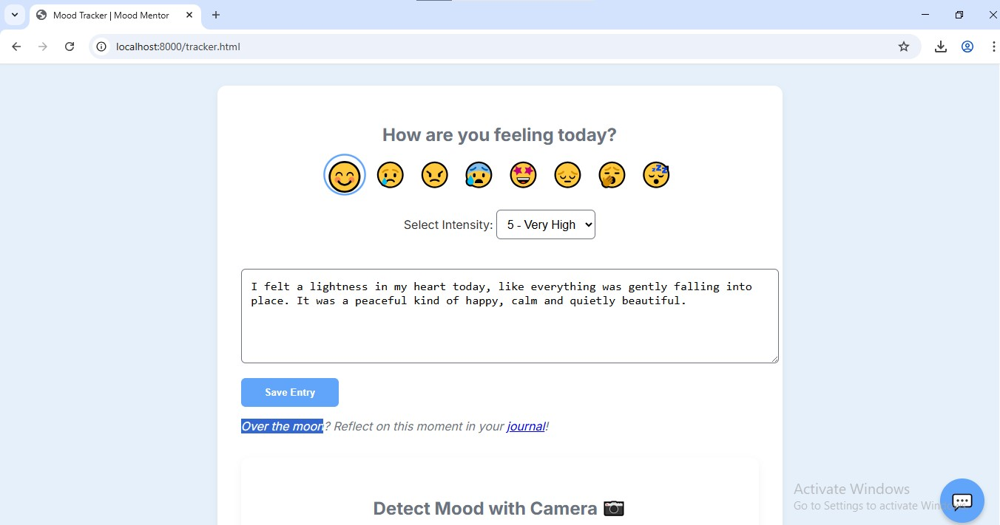
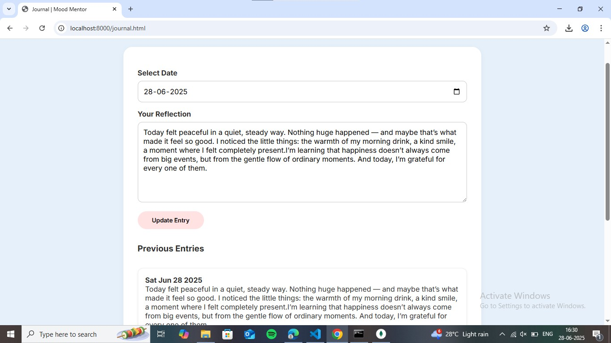
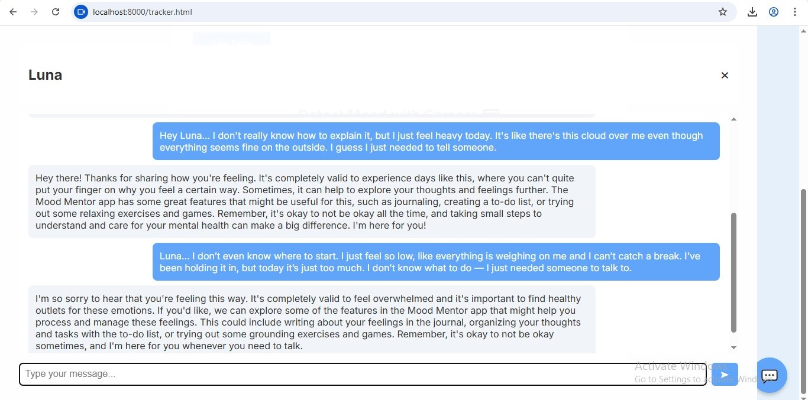

#  MoodMentor

**MoodMentor** is a simple, interactive mood tracking app designed to help you understand your emotions and improve your mental well-being. Track your mood, get personalized tips, and engage with fun games that help lift your spirits!

---

## 🧠 Features

✅ **Mood Tracking (with Camera Detection)** – Log your mood manually or let the app analyze your facial expressions using your webcam.  
📅 **Journal Entries** – Write daily reflections tied to each calendar date.  
💬 **AI Chatbot** – Talk to a friendly GPT-powered chatbot to express your thoughts and feelings.  
🧘 **Mindfulness Tools** – Access simple breathing and calming exercises.  
📈 **Mood Insights** – View trends and summaries of your emotional journey over time.  
🔒 **Privacy-Focused** – Facial data is analyzed in-browser and not stored. Your journal and mood history are stored securely using Flask + MongoDB.

---

## 🛠️ Tech Stack

- **Frontend**: HTML, CSS, JavaScript  
- **Backend**: Python (Flask)  
- **Database**: MongoDB  
- **AI Integration**: Cohere.ai API (Command R+ for chatbot interaction)  
- **Other**: Webcam-based mood detection using JavaScript

---

##  🎨 Design

- **Primary Color (Accent)**: #A0C3D2 (Cool Blue)
- **Accent Color**: #FFE2E2 (Soft Pink)
- **Background**: #F9FAFB (Off White)
- **Text**: #2E2E2E (Deep Gray)

MoodMentor is thoughtfully designed with a soft, minimalist aesthetic that helps users focus on their emotions in a calm, distraction-free environment.

---

## 📸 Preview  
Here’s a quick look at **MoodMentor** in action:

| Mood Tracker | Journal |
|--------------|---------|
|  |  |

| Chatbot | Camera Mood Detection |
|---------|------------------------|
|  |  |

> 💡 Looking for more?  
> Additional screenshots for features like **Mindfulness**, **Games**, and **Insights** can be found in the [`/screenshots`](./screenshots) folder.

---

##  🤝 Built By

Created by Jilsa Mariya to explore mental wellness apps with fun and engaging tools.

---
